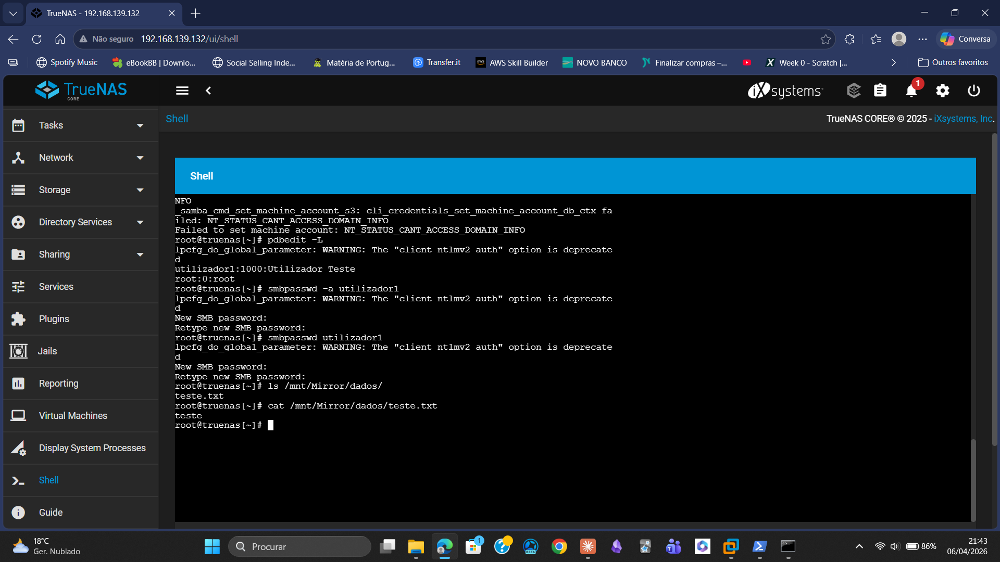

# 05 — Phase 2: Shell Alternative and Storage Validation

## Approach

Unable to access the SMB share from Windows, the **TrueNAS built-in Shell** (accessible via browser at `http://192.168.139.132/ui/shell`) was used to create and verify files directly on the server.

This approach proved that the **storage system was fully functional** — the problem was exclusively related to SMB access configuration, not to TrueNAS itself.

---

## Commands Executed

```bash
# Create a test file in the Mirror pool dataset
echo "teste" > /mnt/Mirror/dados/teste.txt

# List the dataset contents
ls /mnt/Mirror/dados/

# Verify file contents
cat /mnt/Mirror/dados/teste.txt
```

---

## Results

**Figure 1** — `ls /mnt/Mirror/dados/` listing the test file:



**Figure 2** — `cat /mnt/Mirror/dados/teste.txt` confirming file contents:


---

## What This Proved

- The Mirror pool (RAID-1) was created and working correctly
- The dataset `/mnt/Mirror/dados` was accessible and writable
- Files could be created and read on the TrueNAS storage system
- The SMB problem was not a storage issue — it was a configuration issue

---

## Key Takeaway

> When facing a blocked path, find an alternative route to prove progress and isolate the problem.  
> The Shell approach confirmed the storage layer was healthy, narrowing the investigation to the SMB configuration layer.
