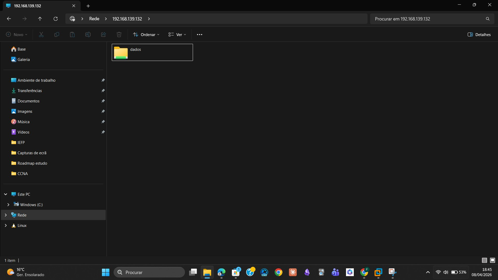
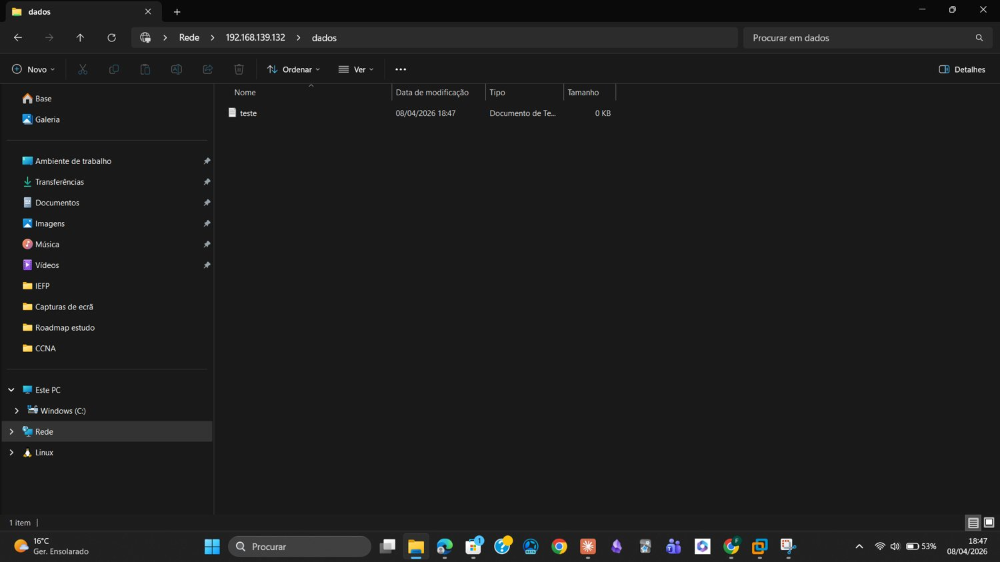

# 06 — Phase 3: Root Cause Identified and Final Resolution

## Root Cause Analysis

After reviewing all the errors and failed attempts, the root cause was identified:

> **The dataset `/mnt/stripe/dados` had been created without valid and complete ACL (Access Control List) permissions.**

Without correct ACLs, TrueNAS refused all external access to the dataset — before even checking user credentials. This explains the Error 67 ("network name cannot be found") — the server was rejecting the connection at the permissions layer, not the protocol layer.

### SMB Access Sequence

```
1. Windows establishes TCP connection to server on port 445
2. Server checks dataset ACL permissions  ← BLOCKED HERE
3. Server requests authentication
4. User authenticates with username and password
5. Access granted or denied
```

The block was occurring at step 2 — incomplete ACLs prevented access before any credential verification took place.

---

## Fix — Applying Correct ACL Permissions

### Steps in TrueNAS Web UI

1. Go to **Storage → Pools**
2. Select the **stripe** pool
3. Open the **dados** dataset
4. Click **Edit ACL**
5. Select preset: **OPEN**
6. Click **Save**

### About the OPEN Preset

The **OPEN** preset grants full permissions (read, write, execute) to all users. It is appropriate for lab environments where access control is managed at the share level rather than the filesystem level.

| Parameter | Value |
|-----------|-------|
| ACL Preset | OPEN |
| Permissions | Read + Write + Execute (all users) |
| Dataset | /mnt/stripe/dados |
| Result | ACL saved successfully |

---

## New SMB Share Configuration

With the dataset correctly configured, a new SMB share was created:

| Parameter | Value |
|-----------|-------|
| Path | /mnt/stripe/dados |
| Share Name | dados |
| SMB Service | Active — auto-start enabled |
| ACL Preset | OPEN |

---

## Proof of Success

### Accessing via Windows File Explorer

In Windows File Explorer, the following address was entered in the navigation bar:

```
\\192.168.139.132
```

**Figure 3** — SMB access established: `dados` folder visible in Windows 11 File Explorer:



### Creating a File from Windows

Inside the `dados` folder, a text file was created directly from Windows using the traditional method: right-click → New → Text Document.

**Figure 4** — File `teste` created successfully via Windows 11 on the TrueNAS SMB share:



---

## Final Result

| Check | Status |
|-------|--------|
| SMB access from Windows 11 | OK |
| File created from Windows | OK |
| Bidirectional communication confirmed | OK |
| Root cause identified and resolved | OK |

> **The problem was never a protocol incompatibility.**  
> It was incorrect ACL permissions on the dataset — a simple fix once the root cause was identified.
