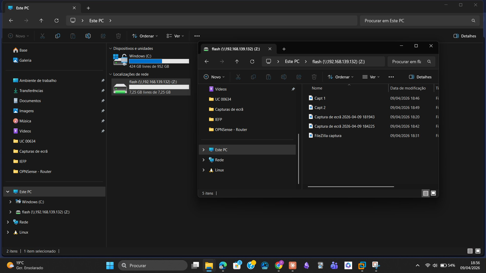
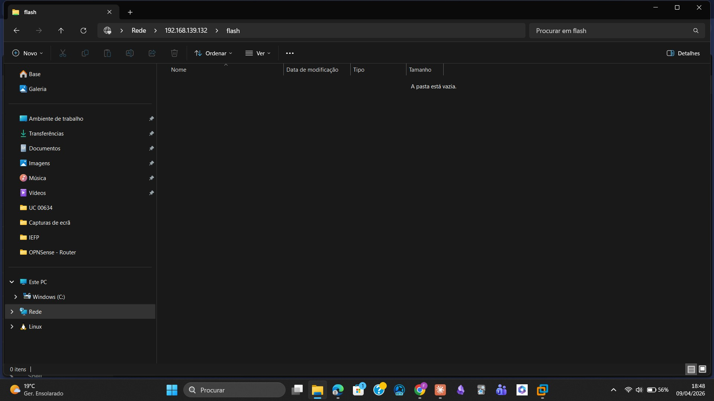
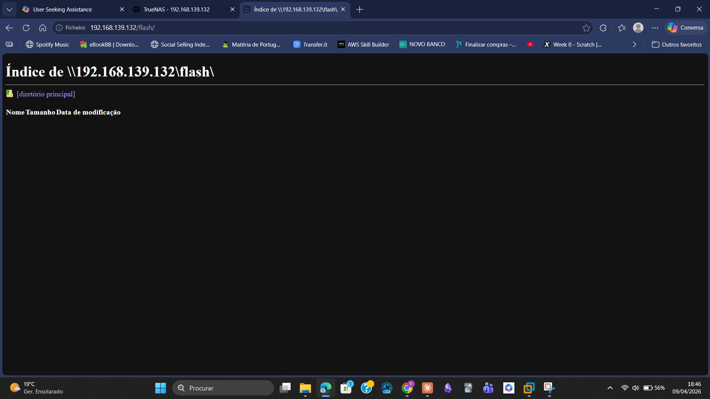

# 07 — Phase 4: Mapped Network Drive (Flash)

## Objective

Simulate a virtual USB pen drive accessible from Windows, using an SMB share from TrueNAS mapped as a network drive.

---

## Dataset Creation

Inside the Mirror pool, a new dataset was created:

| Parameter | Value |
|-----------|-------|
| Pool | Mirror |
| Dataset Name | flash |
| Path | /mnt/Mirror/dados/flash |
| Purpose | Virtual USB pen drive simulation |

---

## ACL Permissions

The OPEN preset was applied to the flash dataset:

| Parameter | Value |
|-----------|-------|
| ACL Preset | OPEN |
| Owner | utilizador1 |
| Permissions | Read + Write + Execute (all users) |

---

## SMB Share Configuration

| Parameter | Value |
|-----------|-------|
| Share Name | flash |
| Path | /mnt/Mirror/dados/flash |
| SMB Service | Active — auto-start |
| ACL | OPEN — Owner: utilizador1 |

**Figure 5** — TrueNAS Web UI showing both active SMB shares (dados + flash):



---

## Mapping the Drive in Windows

The share was accessed and mapped as drive **Z:** in Windows File Explorer:

```
\\192.168.139.132\flash
```

**Figure 6** — Flash share accessible via Windows File Explorer:



**Figure 7** — Drive Z: mapped as 'flash' with available space and files visible:



---

## Drive Behavior

The mapped drive behaved exactly like a USB pen drive:

- Drive letter assigned (Z:)
- Total and free space visible (7.25 GB free of 7.25 GB)
- Disconnect option available — equivalent to safely ejecting
- Full read/write access confirmed
- Files created and read successfully

---

## Result

> SMB share 'flash' successfully mapped as drive Z: in Windows 11.  
> Behavior identical to a physical USB pen drive.  
> Read and write operations confirmed.
