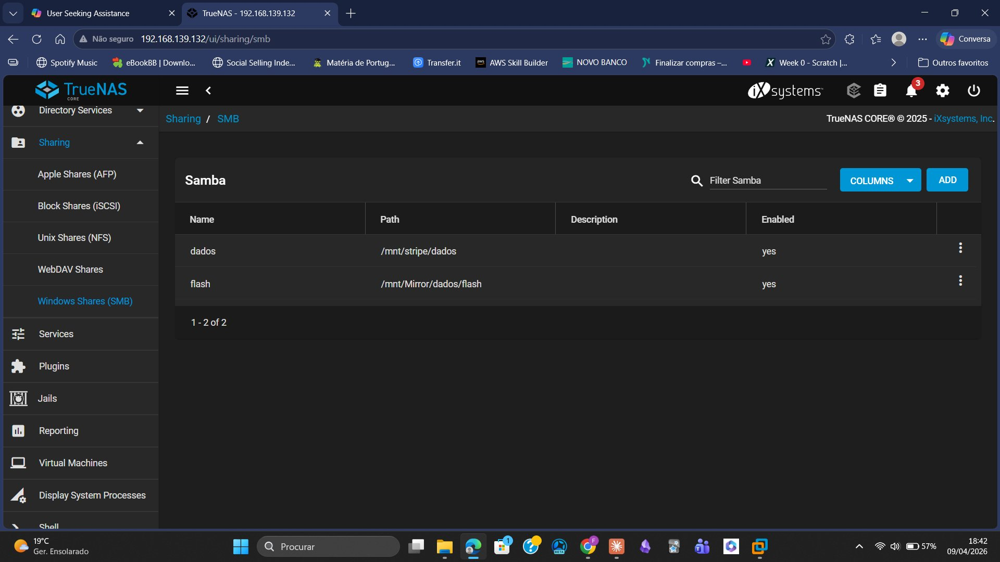

# 08 — Phase 5: SFTP Access via FileZilla

## Overview

To complement the SMB access demonstrated in previous phases, SFTP (SSH File Transfer Protocol) was configured and tested using the **FileZilla Client**.

SFTP is a secure file transfer protocol built on top of SSH, widely used in enterprise environments for encrypted file transfers between systems.

---

## SFTP vs FTP

| | FTP | SFTP |
|-|-----|------|
| Encryption | None | Full (SSH) |
| Port | 21 | 22 |
| Security | Insecure | Secure |
| Credentials | Plain text | Encrypted |
| Use in production | Not recommended | Recommended |

---

## Connection Settings in FileZilla

| Parameter | Value |
|-----------|-------|
| Host | sftp://192.168.139.132 |
| Username | utilizador1 |
| Password | (lab environment) |
| Port | 22 |
| Protocol | SFTP — SSH File Transfer Protocol |

---

## Connection Established

The SFTP connection was established successfully. FileZilla displayed the TrueNAS directory structure in the right panel (remote server) and the local Windows files in the left panel.

**Figure 8** — FileZilla Client: SFTP connection to TrueNAS showing teste.txt in /mnt/Mirror/dados:

---

## File Verification

Navigating to `/mnt/Mirror/dados`, the test file created in previous phases was confirmed:

| Property | Value |
|----------|-------|
| File | teste.txt |
| Size | 6 bytes |
| Permissions | -rw-r--r-- |
| Owner | root wheel |
| Date | 06/04/2026 |

---

## Result

> SFTP connection successfully established via FileZilla Client.  
> TrueNAS directory structure fully navigable from Windows.  
> File teste.txt confirmed in /mnt/Mirror/dados.  
> Secure, encrypted file transfer operational over SSH port 22.
